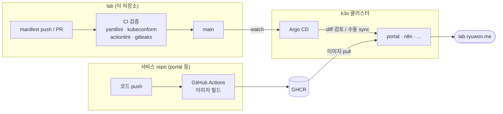

# lab

ryuwon 홈랩의 public GitOps 저장소입니다. OCI 위에 올린 k3s 클러스터를
Argo CD로 관리하며, 이 repo의 `platform/` 트리에서 클러스터의 애플리케이션 상태를 확인할 수 있습니다.

앱 코드는 각 서비스 repo에서 관리하고, 빌드된 이미지를 어떤 namespace와
Ingress로 배포할지를 여기서 정합니다. 현재 운영 중인 서비스 목록은
[lab.ryuwon.me](https://lab.ryuwon.me)에서 확인할 수 있습니다.

## Contents

이 저장소는 클러스터를 구성하는 다음 요소들로 구성되어 있습니다

* HTTP/HTTPS 라우팅 (ingress-nginx)
* TLS 인증서 발급과 갱신 (cert-manager)
* SSO 인증 (Authentik)
* 암호화된 Secret 관리 (Sealed Secrets)
* 워크플로 자동화 (n8n)
* `lab.ryuwon.me` 서비스 포털 (portal)
* 그 외 namespace, AppProject, Argo CD Application 선언
* 서비스들도 추가될 예정입니다 :D

## Domains

| Domain | Role |
| --- | --- |
| [lab.ryuwon.me](https://lab.ryuwon.me) | 홈랩 서비스 포털 |
| [argo.ryuwon.me](https://argo.ryuwon.me) | Argo CD |
| [auth.ryuwon.me](https://auth.ryuwon.me) | Authentik |
| [n8n.ryuwon.me](https://n8n.ryuwon.me) | 자동화 서비스 |

## CI/CD Flow

push/PR마다 yamllint, kustomize 렌더 + kubeconform 스키마 검증, actionlint, gitleaks secret 스캔을 실행합니다.
검증까지만 담당하고, 배포는 클러스터 안의 Argo CD가 수행합니다.




## Layout

```text
platform/
  bootstrap/      수동 적용하는 Argo CD root app
  applications/   서비스별 child Application
  projects/       Argo CD AppProject
  namespaces/     namespace
  workloads/      직접 관리하는 서비스 manifest (portal, n8n)
  argocd/         Argo CD 설정
  cert-manager/   ClusterIssuer 등 TLS 설정
  ingress/        공통 Ingress
  secrets/        secret 운영 메모와 placeholder
  security/       보안 정책
  monitoring/     모니터링
```


## License & Inspiration

MIT License. 자세한 내용은 [LICENSE](LICENSE)를 참고하세요.

이 구성은 [pmh-only/lab](https://github.com/pmh-only/lab)에서 많은 영감을 받았습니다.
